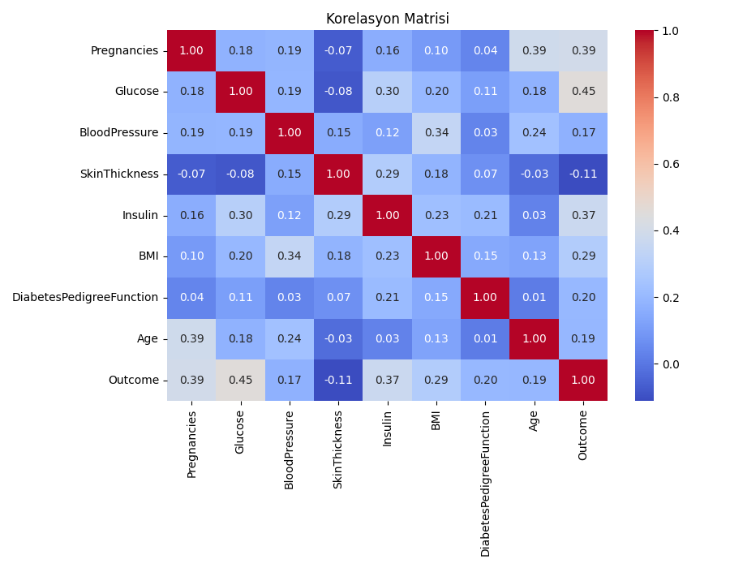
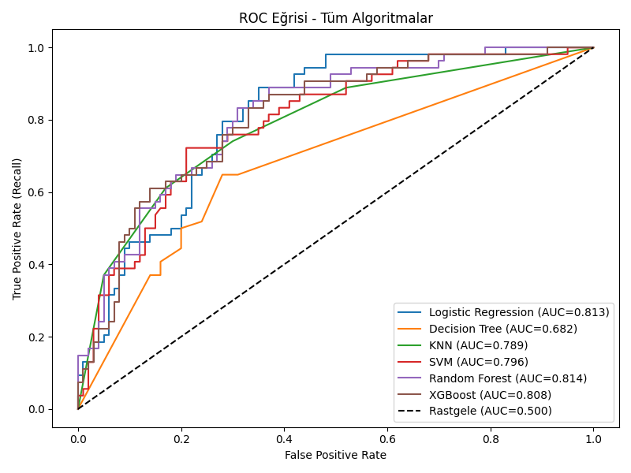
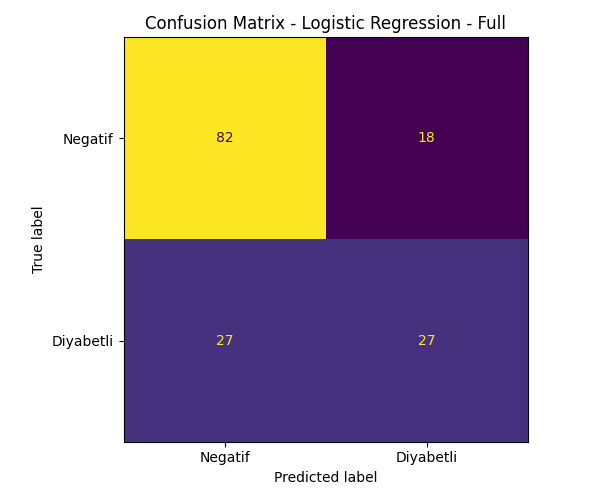

# Diyabet Risk Tahmin Sistemi

Makine öğrenmesi algoritmalarını karşılaştırarak en yüksek doğrulukla diyabet riskini tahmin eden, Streamlit tabanlı interaktif web uygulaması.

---

## Ekran Görüntüleri

| Korelasyon Matrisi | ROC Eğrisi | Confusion Matrix |
|:-:|:-:|:-:|
|  |  |  |

---

## Özellikler

- 5 farklı ML algoritmasını otomatik karşılaştırır ve en iyisini seçer
- Eşik optimizasyonu ile diyabetli bireyleri kaçırma riskini minimize eder
- Streamlit arayüzü üzerinden anlık tahmin yapılabilir
- Veri sızıntısı (data leakage) önlemleri alınmıştır

---

## Kullanılan Algoritmalar

| Algoritma | Açıklama |
|---|---|
| Logistic Regression | Temel sınıflandırma |
| Decision Tree | Karar ağacı |
| KNN | K-en yakın komşu |
| Random Forest | Topluluk yöntemi |
| XGBoost | Gradient boosting |

Her algoritma hem **tüm özelliklerle** hem de **en önemli 5 özellikle** test edilir (10 kombinasyon).

---

## Veri Seti

[Pima Indians Diabetes Dataset](https://www.kaggle.com/datasets/uciml/pima-indians-diabetes-database) — 768 hasta, 8 özellik

| Özellik | Açıklama |
|---|---|
| Pregnancies | Hamilelik sayısı |
| Glucose | Kan şekeri (mg/dL) |
| BloodPressure | Kan basıncı (mm Hg) |
| SkinThickness | Deri kalınlığı (mm) |
| Insulin | İnsülin seviyesi |
| BMI | Vücut kitle indeksi |
| DiabetesPedigreeFunction | Aile diyabet geçmişi skoru |
| Age | Yaş |

---

## Kurulum ve Çalıştırma

```bash
# Gereksinimleri yükle
pip install streamlit scikit-learn xgboost pandas matplotlib seaborn

# Modeli eğit
python model.py

# Web uygulamasını başlat
streamlit run app.py
```

---

## Model Pipeline

```
Veri Yükleme → Temizleme (Medyan İmputasyon)
     ↓
Korelasyon Analizi
     ↓
Train/Test Split (80-20, Stratified)
     ↓
Özellik Seçimi (Mutual Information — sadece train verisi)
     ↓
5 Algoritma × 2 Özellik Seti = 10 Kombinasyon
     ↓
En İyi Model Seçimi (Accuracy + AUC)
     ↓
Eşik Optimizasyonu (F1 Score bazlı)
     ↓
model.pkl kaydet
```

---

## Kullanılan Teknolojiler


