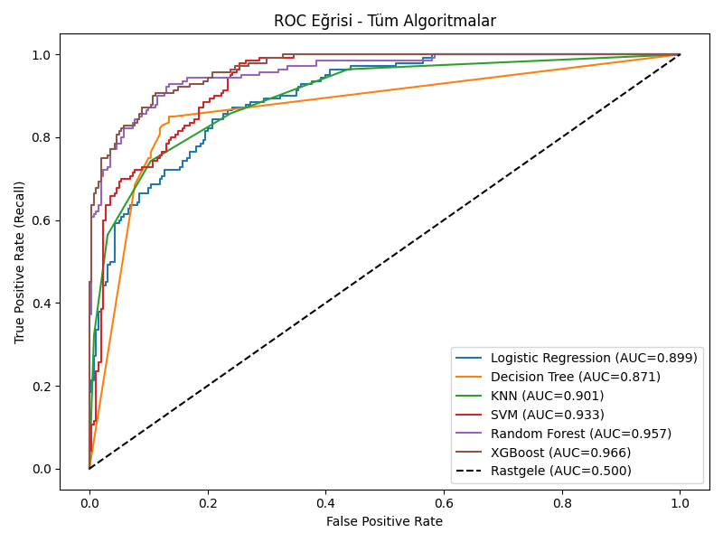
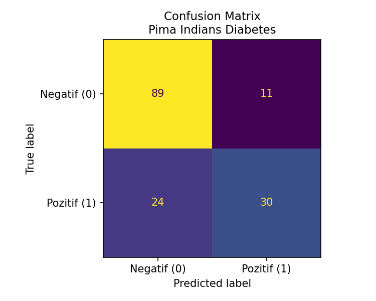
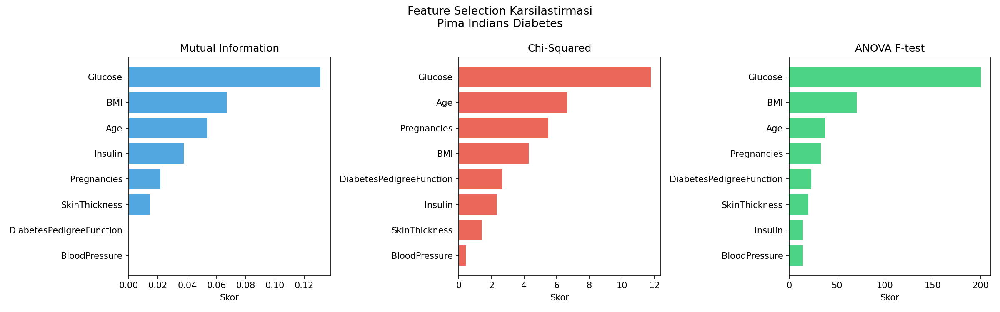
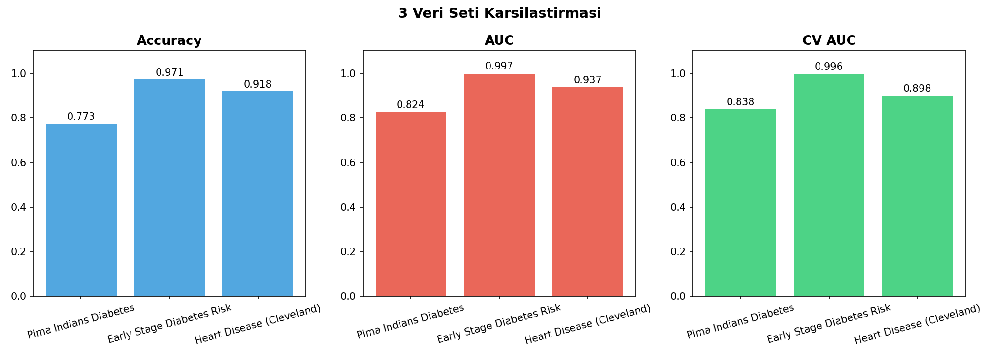

# Diyabet Risk Tahmin Sistemi

Makine öğrenmesi algoritmalarını karşılaştırarak diyabet riskini tahmin eden, 3 farklı veri seti üzerinde test edilmiş, Streamlit tabanlı interaktif web uygulaması.

---

## Ekran Görüntüleri

| Korelasyon Matrisi | ROC Eğrisi | Confusion Matrix |
|:-:|:-:|:-:|
|  |  |  |

| Feature Selection | Karşılaştırma |
|:-:|:-:|
|  |  |

---

## Özellikler

- 3 farklı veri setinde test edilmiş genellenebilir pipeline
- 6 farklı ML algoritmasını otomatik karşılaştırır ve en iyisini seçer
- 5 farklı feature selection yöntemi karşılaştırması
- Optuna ile hiperparametre optimizasyonu (50 deneme, önbellekleme ile)
- RepeatedStratifiedKFold ile 10 iterasyon (5 fold × 2 tekrar)
- Sentetik veri üretimi (SDV GaussianCopula) ile veri artırma
- Eşik optimizasyonu ile diyabetli bireyleri kaçırma riskini minimize eder
- Streamlit arayüzü üzerinden anlık tahmin yapılabilir
- Veri sızıntısı (data leakage) önlemleri alınmıştır

---

## Kullanılan Algoritmalar

| Algoritma | Açıklama |
|---|---|
| Logistic Regression | Temel sınıflandırma |
| Decision Tree | Karar ağacı |
| KNN | K-en yakın komşu |
| SVM | Destek vektör makinesi |
| Random Forest | Topluluk yöntemi |
| XGBoost | Gradient boosting |

Her algoritma hem **tüm özelliklerle** hem de **en önemli 5 özellikle** test edilir (12 kombinasyon).

---

## Veri Setleri

| Veri Seti | Kaynak | Satır | Özellik | Hedef |
|---|---|---|---|---|
| Pima Indians Diabetes | UCI / NIDDK | 768 | 8 | Diyabet var/yok |
| Early Stage Diabetes Risk | UCI (ID:529) | 520 | 16 | Diyabet var/yok |
| Heart Disease (Cleveland) | UCI (ID:45) | 303 | 13 | Hastalık var/yok |

---

## Sonuçlar

| Veri Seti | En İyi Model | Accuracy | AUC |
|---|---|---|---|
| Pima Indians Diabetes | XGBoost | %90.2 | 0.966 |
| Early Stage Diabetes Risk | XGBoost | %97.1 | 0.994 |
| Heart Disease (Cleveland) | Random Forest | %88.5 | 0.954 |

---

## Proje Yapısı

```
diyabet_projesi/
│
├── data/                          ← Veri setleri
│   ├── diabetes.csv               ← Pima Indians (orijinal)
│   ├── early_stage_diabetes.csv   ← Early Stage Diabetes (UCI)
│   └── heart_disease.csv          ← Heart Disease Cleveland (UCI)
│
├── output/                        ← Grafikler
│   ├── pima_diabetes/             ← Pima grafikleri
│   ├── early_stage_diabetes/      ← Early Stage grafikleri
│   ├── heart_disease/             ← Heart Disease grafikleri
│   └── karsilastirma/             ← 3 veri seti karşılaştırması
│
├── cache/                         ← Optuna parametre dosyaları
│
├── model.py                       ← Ana model (Pima, tam detay)
├── coklu_veri.py                  ← 3 veri seti karşılaştırması
├── veri_artir.py                  ← Sentetik veri üretimi (SDV)
├── app.py                         ← Streamlit arayüzü
├── tek_tikla_calistir.bat         ← Kolay çalıştırma (Windows)
├── NASIL_CALISTIRILIR.md          ← Çalıştırma kılavuzu
└── README.md
```

---

## Kurulum ve Çalıştırma

```bash
# Gereksinimleri yükle
pip install -r requirements.txt

# 1. Sentetik veri üret (isteğe bağlı)
python veri_artir.py

# 2. Ana modeli eğit (Pima)
python model.py

# 3. Çoklu veri seti karşılaştırması
python coklu_veri.py

# 4. Web uygulamasını başlat
streamlit run app.py
```

---

## Model Pipeline

```
Veri Yükleme
     ↓
Temizleme (Medyan İmputasyon)
     ↓
Korelasyon Analizi
     ↓
Train/Test Split (RepeatedStratifiedKFold — 10 iterasyon)
     ↓
Sınıf Dengeleme (Downsampling, hedef 2:1)
     ↓
Feature Selection (5 Yöntem: MI, Chi2, ANOVA, RFE, SelectFromModel)
     ↓
Hiperparametre Optimizasyonu (Optuna — 50 deneme, önbellekli)
     ↓
6 Algoritma × 2 Özellik Seti = 12 Kombinasyon
     ↓
En İyi Model Seçimi (CV-AUC öncelikli)
     ↓
Eşik Optimizasyonu (F1-Score bazlı)
     ↓
model.pkl kaydet
```

---

## Feature Selection Yöntemleri

| Yöntem | Açıklama |
|---|---|
| Mutual Information | Özellik-hedef bağımlılığı |
| Chi-Squared | Kategorik ilişki testi |
| ANOVA F-test | Gruplar arası varyans analizi |
| RFE | Recursive Feature Elimination |
| SelectFromModel | Model tabanlı özellik seçimi |

---

## Kullanılan Teknolojiler


